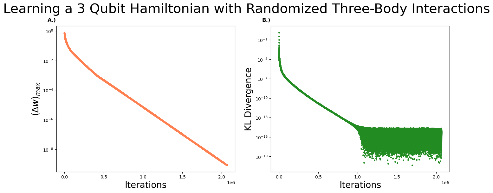
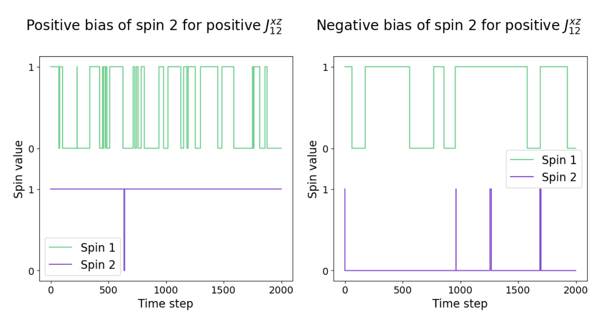

# Modeling Stochastic Dynamics using Quantum Boltzmann Machines

This repository contains the code developed for my BSc thesis in Physics: **Modeling Stochastic Dynamics using Quantum Boltzmann Machines (QBMs)**. The goal of this project is to explore how QBMs can model stochastic dynamics in ways that classical Boltzmann Machines (BMs) cannot.

The repository includes two main Jupyter notebooks:

- **`Quantum_Boltzmann_Machine.ipynb`** – Implements a QBM, allowing users to train and experiment with small-scale quantum models.
- **`Quantum-Classical_Mapping.ipynb`** – Investigates how QBMs capture dynamical properties of classical stochastic systems that classical BMs overlook.

Below is a quick breakdown of both.

## Quantum Boltzmann Machines

A **Quantum Boltzmann Machine (QBM)** is an extension of the classical Boltzmann Machine [1]. QBMs leverage quantum effects to uncover statistical dependencies in classical data that classical BMs cannot [2]. This makes them an interesting tool for learning hidden structures in data.

While large-scale QBMs require quantum hardware, small-scale versions can be simulated classically. This notebook provides a Python-based implementation where you can train a QBM using gradient-based optimization, analyze the trained parameters and experiment with different Hamiltonians, including up to three-body interactions:

$$
\hat{H} = \sum_{ijl} \sum_{k,k',k''} \sigma^{k,k',k''}_{ijl} \hat{\sigma}^k_i \hat{\sigma}^{k'}_j \hat{\sigma}^{k''}_l + \sum_{ij} \sum_{k,k'} J^{k,k'}_{ij} \hat{\sigma}^k_i \hat{\sigma}^{k'}_j + \sum_{i} \sum_{k} h^k_i \hat{\sigma}^k_i
$$

where $k = x,y,z$ represents Pauli spin orientations, and $\hat{\sigma}^k_i$ denotes the Pauli matrix acting on site $i$.

For an in-depth explanation of QBM training and results, check out the thesis or the notebook.



## Quantum-Classical Mapping

Classical Boltzmann Machines are limited to modeling **equilibrium properties** (e.g., average magnetization). However, real-world learning tasks often involve **dynamical properties**—how a system evolves over time.

To explore what additional information a QBM can extract, we set up a simple stochastic network of binary spins. By adjusting transition probabilities (while keeping the equilibrium distribution fixed), we analyze how QBMs infer relationships that classical BMs miss.

### Example: Spin Flipping Rates

A classical BM can infer that a spin spends 30% of its time in the +1 state and 70% in the -1 state via the parameter $h_i$. A QBM also captures this through $h^z_i$, but it can _additionally__ infer **how frequently** a spin flips between states using $h^x_i$. Interestingly, we observed that the relation between flipping rates and $h^x_i$ is **non-linear**.

This relationship between classical properties and quantum parameters is what we refer to as the **"quantum-classical mapping."**

### Higher-Order Correlations

QBMs also capture more complex dependencies—for example, how one spin’s bias relates to another’s flipping rate (encoded in $J_{ij}^{xz}$). These higher-order correlations are invisible to classical BMs but become apparent in the QBM framework.

For a deeper dive, check out the notebook and thesis.



## Installation

To run the notebooks, install the required environment using Conda:

```bash
conda env create -f environment.yml
conda activate QBM
```

This will install all necessary dependencies, including NumPy, Numba and SciPy

## Future Work

A few suggestions for future work:

- **Analytical Treatment & Quantum-Classical Mapping**: A *D*-dimensional equilibrium quantum model can be used to study a (*D*-1)-dimensional classical system [1]. In simpler terms, the equilibrium properties of a quantum system (which a QBM learns) can be mapped onto the dynamical properties of a classical system. An open question is *why* does an *equilibrium* quantum model capture the *dynamics* of a classical system? The paper hints at an explanation, but the exact mechanism isn’t entirely clear.

- **Analysing Non-Linearities**:One of the strangest observations is the **non-linearity** in the relationship between certain QBM parameters and classical properties. Take a look at the graphs on pages 18 and 19. Intuitively, you’d expect a linear relationship, but that’s not what we see. Why? Understanding this unexpected behavior could be interesting.

- **Optimizing State Storage**: Implementing a lookup table (e.g., using a dictionary) to index and store states would significantly improve memory efficiency. The current approach explicitly assigns an index to *every* state in Hilbert space, requiring extensive bookkeeping to track them properly. A more efficient method would streamline the code and reduce overhead.

---

## Supplementary Notebooks

- Simulate_Ising_Model.ipynb – Simulates a classical Ising model.
- Classical_Boltzmann_Machine.ipynb – Implements a classical BM for baseline analysis.
- Quantum_Classical_Mapping_Theory.ipynb – Dives deeper into the theoretical aspects of the quantum-classical mapping.

---

## References

[1] Amin, Mohammad H., et al. "Quantum boltzmann machine." Physical Review X 8.2 (2018): 021050.

[2] Kappen, Hilbert J. "Learning quantum models from quantum or classical data." _Journal of Physics A: Mathematical and Theoretical_ 53.21 (2020): 214001.

[3] Suzuki, Masuo. "Relationship between d-dimensional quantal spin systems and (d+ 1)-dimensional ising systems: Equivalence, critical exponents and systematic approximants of the partition function and spin correlations." Progress of theoretical physics 56.5 (1976): 1454-1469